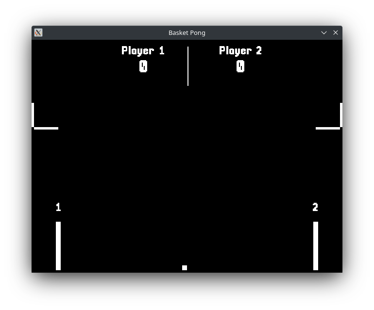

# basket-pong
A basket-ball game made in C using SDL.
<p align="center">
  
</p>

## Controls
WASD keys - Player one movement  
Arrow keys - Player two movement  
Space - Shoot (both players share this key)

## Conditions
First player with 5 points wins.

## Libraries used
  * [SDL2](https://www.libsdl.org/)
  * [SDL_TTF](https://www.libsdl.org/projects/SDL_ttf/)
  * [SDL_Mixer](https://www.libsdl.org/projects/SDL_mixer/)

## Building project
```
git clone https://github.com/sakertooth/basket-pong/
cd basket-pong
mkdir build && cd build
cmake ..
cmake --build .
```
